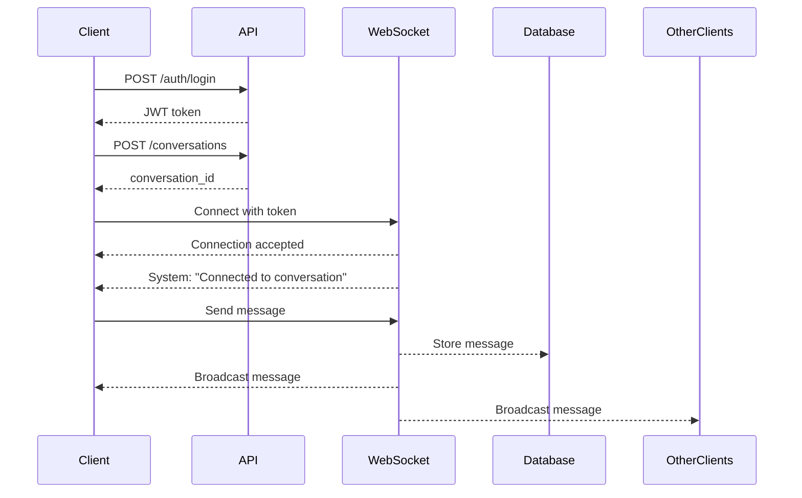

# WebSocket Chat Quick Start Guide

## Prerequisites

- Backend running on `localhost:8000`
- Valid user account (username/password)

## Quick Test

### 1. Register a User (if needed)

```bash
curl -X POST "http://localhost:8000/auth/register" \
  -H "Content-Type: application/json" \
  -d '{
    "username": "chatuser",
    "email": "chat@example.com",
    "password": "chatpass123",
    "full_name": "Chat User"
  }'
```

### 2. Start Interactive Chat Client

```bash
# Inside the Docker container
docker exec -it ml_proj-backend-1 python interactive_chat_client.py chatuser chatpass123

# Or with Python installed locally (requires websockets and requests)
python interactive_chat_client.py chatuser chatpass123
```

### 3. Chat Commands

Once connected, you can:

- Type any message and press Enter to send
- `/users` - Show active users in conversation
- `/ping` - Send a ping to test connection
- `/quit` - Exit chat

## WebSocket Connection Details

### Endpoint

```
ws://localhost:8000/ws/conversations/{conversation_id}?token={jwt_token}
```

### Getting a JWT Token

```bash
# Login to get token
curl -X POST "http://localhost:8000/auth/login" \
  -H "Content-Type: application/json" \
  -d '{"username": "chatuser", "password": "chatpass123"}'

# Response includes:
# {"access_token": "eyJhbGc...", "token_type": "bearer"}
```

### Creating a Conversation

```bash
curl -X POST "http://localhost:8000/conversations" \
  -H "Content-Type: application/json" \
  -H "Authorization: Bearer YOUR_TOKEN_HERE" \
  -d '{"title": "My Chat Room"}'

# Response includes:
# {"id": "conv_123", "title": "My Chat Room", ...}
```

## Message Format

### Sending Messages (Client → Server)

```json
{
  "type": "message",
  "content": "Hello, everyone!",
  "role": "user"
}
```

### Receiving Messages (Server → Client)

```json
{
  "type": "message",
  "message_id": "msg_abc123",
  "content": "Hello, everyone!",
  "role": "user",
  "sender": {
    "user_id": "user_123",
    "username": "chatuser",
    "full_name": "Chat User"
  },
  "timestamp": "2025-10-11T16:45:30.123456Z",
  "conversation_id": "conv_123"
}
```

### System Messages

```json
{
  "type": "system",
  "content": "chatuser joined the chat",
  "timestamp": "2025-10-11T16:45:30.123456Z"
}
```

### Active Users Response

```json
{
  "type": "active_users",
  "users": [
    {
      "user_id": "user_123",
      "username": "chatuser",
      "full_name": "Chat User"
    }
  ],
  "count": 1
}
```

## Testing with Python

### Simple Test Script

```python
import asyncio
import websockets
import json

async def test_chat():
    # Replace with your token and conversation_id
    token = "YOUR_JWT_TOKEN"
    conversation_id = "YOUR_CONVERSATION_ID"

    uri = f"ws://localhost:8000/ws/conversations/{conversation_id}?token={token}"

    async with websockets.connect(uri) as websocket:
        # Send a message
        await websocket.send(json.dumps({
            "type": "message",
            "content": "Hello from Python!",
            "role": "user"
        }))

        # Receive response
        response = await websocket.recv()
        print(f"Received: {response}")

asyncio.run(test_chat())
```

## Running the Test Suite

### Run All Tests

```bash
docker exec ml_proj-backend-1 python test_websocket_chat.py
```

### Expected Output

```
============================================================
WebSocket Chat Testing Suite
============================================================

TEST 1: Single User Chat
✅ User testuser_ws1 registered successfully
✅ User testuser_ws1 logged in successfully
✅ Conversation 'Test Chat 1' created
✅ Connected to conversation
📨 Messages sent and received
✅ Single user test completed
```

## Troubleshooting

### "Connection failed: HTTP 404"

- WebSocket endpoint not found
- Check backend is running: `curl http://localhost:8000/health`
- Ensure uvicorn has WebSocket support installed

### "Connection failed: HTTP 403"

- User doesn't have access to conversation
- Verify the conversation was created by the same user

### "Authentication failed"

- Invalid or expired JWT token
- Login again to get a fresh token

### "websockets module not found"

- Install: `pip install websockets`
- Or in Docker: `docker exec ml_proj-backend-1 pip install websockets`

## API Endpoints Reference

| Method | Endpoint                 | Description               |
| ------ | ------------------------ | ------------------------- |
| POST   | `/auth/register`         | Register new user         |
| POST   | `/auth/login`            | Get JWT token             |
| GET    | `/auth/me`               | Get current user          |
| POST   | `/conversations`         | Create conversation       |
| GET    | `/conversations`         | List user's conversations |
| WS     | `/ws/conversations/{id}` | WebSocket chat endpoint   |

## Example Flow



## Tips

1. **Keep Connection Alive**: Send ping messages periodically
2. **Handle Reconnection**: Implement retry logic for network issues
3. **Store Messages**: Messages are persisted in database
4. **Check Logs**: Backend logs show all connection events
5. **Test First**: Use the test suite before building complex clients

## Support

For issues or questions:

- Check backend logs: `docker logs ml_proj-backend-1`
- Review test suite for examples
- Ensure all dependencies are installed
